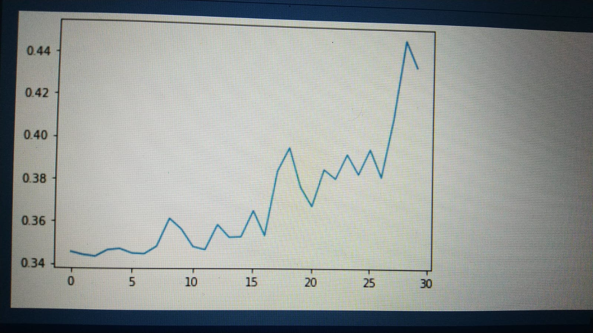
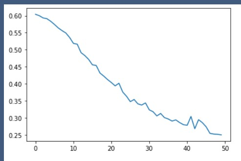

The folder contains explained/annotated paper of AlexNet
and its implementation in pyTorch.

I have used celeba dataset and used AlexNet for binary classification task.

Key things to note:
1. AlexNet is a relatively deep NN.
2. Hyper-parameter tuning is one of the most important part in 
tuning the performance of your model, given your architecture is fixed to 
a certain extent.
# Before tuning

# After tuning

3. Note that there is a use of Adaptive-average-pooling to confine the size to 6x6x256, this
is a necessary step to avoid CUDA_CUBALS error. It ensures correct dimension of the matrix before
it is falttened for a linear layer.
4. Make sure you apply log softmax at the end according to the classes you wish to train on.

