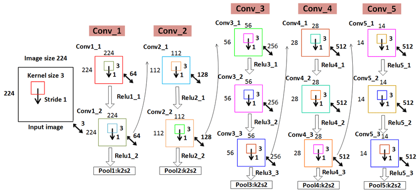

The folder contains explained/annotated paper of AlexNet
and its implementation in pyTorch.

I have a dummy image and used VGG for a simple implementation.

Key things to note:
1. VGG is a relatively deep NN but interestingly uses very small sized kernels.

2. Based on the number of layers there are several configurations of VGG-
# Congfig A

# Config B

3. One more interesting speciality of VGG network is that we can utilise it to separate the
content and style of images. Basically the small filter size is the key here, it enables us to capture
not only smaller but also larger features of an image.

4. There is another paper which I will try to implement next, based on the architecture of VGG.

